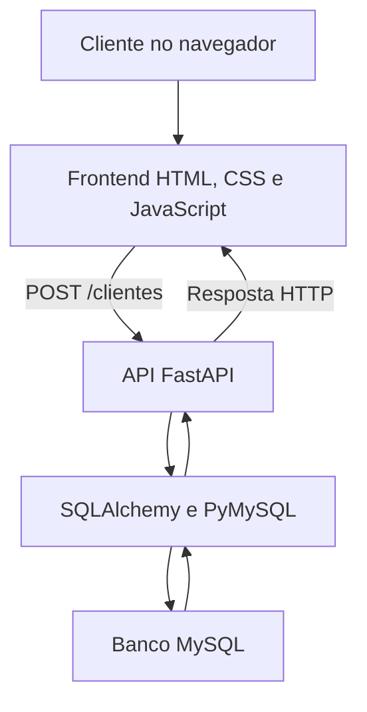

# RF-001 — Cadastro de Cliente

## 1. Identificação do Requisito

- **ID:** RF-001
- **Título:** Cadastro de novo cliente
- **Tipo:** Requisito funcional
- **Prioridade:** Alta
- **Complexidade:** Média — 5 Story Points
- **Status:** Em planejamento
- **Data de criação:** 02/09/2026
- **Última atualização:** 02/09/2026

## Breve descrição

O sistema deverá permitir que um novo cliente realize seu cadastro na plataforma Weblue, informando nome completo, e-mail, CPF, telefone e senha.

Antes de concluir o cadastro, o sistema deverá validar os dados informados e verificar se o CPF ou e-mail já está registrado. Após a validação, os dados deverão ser armazenados com segurança e o cliente receberá uma mensagem de confirmação.

## 2. Descrição e Atores

### 2.1 Descrição detalhada

O RF-001 existe para permitir que novos clientes criem uma conta individual na plataforma Weblue. Essa conta será utilizada para identificar o usuário e possibilitar seu acesso às funcionalidades do e-commerce.

Durante o cadastro, o cliente deverá fornecer nome completo, e-mail, CPF, telefone e senha. O sistema validará os campos obrigatórios, o formato dos dados, a segurança da senha e a existência de outro cadastro com o mesmo CPF ou e-mail.

Quando os dados forem válidos, a senha será protegida por criptografia e o cadastro será armazenado no banco de dados. Ao final, o sistema apresentará uma mensagem confirmando a criação da conta.

### 2.2 Benefícios

- Identificar individualmente cada cliente;
- evitar cadastros duplicados;
- proteger os dados pessoais e a senha;
- permitir acesso seguro à conta;
- associar futuramente pedidos e endereços ao cliente;
- facilitar a comunicação entre a Weblue e seus clientes;
- melhorar a experiência de compra.

### 2.3 Contexto do negócio

A Weblue é uma plataforma de comércio eletrônico especializada em cosméticos e produtos de beleza. Para realizar compras e acompanhar pedidos, cada cliente deverá possuir uma conta individual.

O cadastro será a porta de entrada do usuário para as funcionalidades privadas da plataforma. Por isso, os dados deverão ser validados e armazenados de forma segura, respeitando a Lei Geral de Proteção de Dados Pessoais — LGPD.

### 2.4 Atores do sistema

#### Ator 1 — Novo cliente

**Tipo:** Ator principal.

**Descrição:** Pessoa que deseja criar uma conta na plataforma Weblue.

**Responsabilidades:**

- preencher os campos obrigatórios;
- fornecer informações verdadeiras;
- cadastrar um CPF e e-mail válidos;
- criar uma senha que atenda aos critérios de segurança;
- aceitar os termos de uso e a política de privacidade.

#### Ator 2 — Administrador

**Tipo:** Ator secundário.

**Descrição:** Usuário autorizado a administrar os cadastros da plataforma.

**Responsabilidades:**

- consultar os clientes cadastrados;
- corrigir informações quando autorizado;
- analisar inconsistências;
- ativar ou desativar contas;
- atender solicitações relacionadas aos dados pessoais.

#### Ator 3 — Sistema Weblue

**Tipo:** Ator automático.

**Descrição:** Aplicação responsável por processar a solicitação de cadastro.

**Responsabilidades:**

- verificar os campos obrigatórios;
- validar o formato do e-mail;
- validar o CPF;
- verificar duplicidade de CPF e e-mail;
- validar os critérios da senha;
- proteger a senha antes do armazenamento;
- salvar o cadastro no banco de dados;
- apresentar mensagens de erro ou sucesso.

### 2.5 Permissões CRUD

| Ator | Criar | Consultar | Atualizar | Excluir |
|---|:---:|:---:|:---:|:---:|
| Novo cliente | Sim, a própria conta | Não neste requisito | Não neste requisito | Não |
| Administrador | Sim | Sim | Sim | Apenas desativar ou anonimizar |
| Sistema Weblue | Sim | Sim, para validação | Sim, internamente | Conforme regras administrativas |

> A exclusão definitiva não será realizada diretamente pelo cadastro. Quando necessário, a conta poderá ser desativada ou ter seus dados anonimizados, conforme as regras do sistema e a LGPD.

## 3. Especificação do Caso de Uso

### UC-001 — Realizar cadastro de cliente

| Campo | Descrição |
|---|---|
| **ID** | UC-001 |
| **Requisito relacionado** | RF-001 — Cadastro de Cliente |
| **Nome** | Realizar cadastro de cliente |
| **Ator principal** | Novo cliente |
| **Sistema responsável** | Sistema Weblue |
| **Objetivo** | Permitir que um novo cliente crie uma conta na Weblue |
| **Prioridade** | Alta |
| **Frequência de uso** | Sempre que uma pessoa desejar criar uma conta |
| **Gatilho** | O novo cliente seleciona a opção “Criar conta” |

### 3.1 Pré-condições

- O usuário não deve estar autenticado;
- a página de cadastro deve estar disponível;
- o sistema deve possuir conexão com o banco de dados;
- o CPF e o e-mail informados não podem estar cadastrados;
- o usuário deve ter acesso à internet.

### 3.2 Pós-condições de sucesso

- Uma nova conta será criada;
- os dados permitidos serão armazenados no banco de dados;
- a senha será armazenada utilizando hash seguro;
- o cadastro ficará associado a um identificador único;
- o sistema registrará a data e a hora do cadastro;
- o cliente receberá uma mensagem de sucesso.

### 3.3 Pós-condições de falha

- A conta não será criada;
- nenhum cadastro incompleto será armazenado;
- o sistema apresentará uma mensagem explicando o erro;
- o usuário poderá corrigir os dados e tentar novamente;
- a senha informada não será mantida após falhas críticas;
- o erro técnico poderá ser registrado para auditoria.

### 3.4 Fluxo principal

1. O novo cliente acessa a plataforma Weblue;
2. o cliente seleciona a opção **“Criar conta”**;
3. o sistema apresenta o formulário de cadastro vazio;
4. o cliente informa nome completo, e-mail, CPF, telefone e senha;
5. o cliente confirma a senha;
6. o cliente aceita os termos de uso e a política de privacidade;
7. o cliente seleciona a opção **“Cadastrar”**;
8. o sistema apresenta o estado de carregamento;
9. o sistema verifica se todos os campos obrigatórios foram preenchidos;
10. o sistema valida os formatos do e-mail, CPF e telefone;
11. o sistema verifica se a senha atende aos critérios de segurança;
12. o sistema consulta se o CPF ou e-mail já está cadastrado;
13. o sistema gera um hash seguro para a senha;
14. o sistema armazena os dados do novo cliente;
15. o sistema registra a data e a hora da operação;
16. o sistema apresenta uma mensagem de cadastro realizado com sucesso;
17. o cliente é direcionado para a página de login.

### 3.5 Fluxos alternativos e de exceção

#### FA-001 — Campo obrigatório não preenchido

**Ponto de ocorrência:** Etapa 9 do fluxo principal.

1. O sistema identifica um ou mais campos obrigatórios vazios;
2. destaca os campos que precisam ser preenchidos;
3. apresenta uma mensagem de orientação;
4. não envia os dados ao banco;
5. o fluxo retorna à etapa 4.

#### FA-002 — E-mail, CPF ou telefone inválido

**Ponto de ocorrência:** Etapa 10 do fluxo principal.

1. O sistema identifica o dado com formato inválido;
2. destaca o campo correspondente;
3. apresenta uma mensagem informando o formato esperado;
4. o cliente corrige o dado;
5. o fluxo retorna à etapa 7.

#### FA-003 — Senha fora dos critérios de segurança

**Ponto de ocorrência:** Etapa 11 do fluxo principal.

1. O sistema identifica que a senha não atende aos critérios;
2. informa os critérios mínimos de segurança;
3. solicita a criação de uma nova senha;
4. o cliente informa e confirma a nova senha;
5. o fluxo retorna à etapa 7.

#### FA-004 — CPF ou e-mail já cadastrado

**Ponto de ocorrência:** Etapa 12 do fluxo principal.

1. O sistema identifica um cadastro existente;
2. interrompe a criação da conta;
3. informa que o CPF ou e-mail já está em uso;
4. oferece acesso à página de login ou recuperação de senha;
5. o caso de uso é encerrado sem criar uma nova conta.

#### FE-001 — Falha no banco de dados

**Ponto de ocorrência:** Etapa 14 do fluxo principal.

1. O sistema identifica a indisponibilidade do banco de dados;
2. cancela a operação;
3. impede a criação de um cadastro incompleto;
4. registra o erro técnico;
5. apresenta uma mensagem solicitando uma nova tentativa;
6. o caso de uso é encerrado sem criar a conta.

## 4. Regras de Negócio

### RN-001 — Preenchimento dos campos obrigatórios

O nome completo, e-mail, CPF, telefone, senha e confirmação da senha são obrigatórios. O cadastro não poderá ser concluído enquanto algum desses campos estiver vazio.

**Mensagem:** “Preencha todos os campos obrigatórios.”

### RN-002 — E-mail único

Cada endereço de e-mail poderá estar associado a apenas uma conta. A comparação deverá desconsiderar letras maiúsculas e minúsculas.

**Mensagem:** “Este e-mail já está cadastrado.”

### RN-003 — CPF único

Cada CPF poderá estar associado a apenas uma conta na Weblue.

**Mensagem:** “Este CPF já possui uma conta cadastrada.”

### RN-004 — Validação do CPF

O CPF deverá conter 11 números e ser aprovado pelo algoritmo oficial de validação dos dígitos verificadores. Pontos e traços poderão ser removidos antes do armazenamento.

**Mensagem:** “Informe um CPF válido.”

### RN-005 — Validação do e-mail

O e-mail deverá possuir formato válido, contendo nome do usuário, símbolo `@` e domínio.

**Mensagem:** “Informe um endereço de e-mail válido.”

### RN-006 — Critérios de segurança da senha

A senha deverá possuir:

- no mínimo oito caracteres;
- pelo menos uma letra maiúscula;
- pelo menos uma letra minúscula;
- pelo menos um número;
- pelo menos um caractere especial.

**Mensagem:** “A senha não atende aos critérios de segurança.”

### RN-007 — Confirmação da senha

A senha e sua confirmação deverão ser idênticas.

**Mensagem:** “As senhas informadas não coincidem.”

### RN-008 — Aceitação dos termos

O cadastro somente poderá ser realizado após o usuário aceitar os termos de uso e a política de privacidade da Weblue.

**Mensagem:** “Você precisa aceitar os termos e a política de privacidade.”

### RN-009 — Situação inicial da conta

Toda conta criada com sucesso deverá receber a situação inicial `ATIVA`, salvo quando houver uma etapa futura de confirmação do e-mail.

### RN-010 — Identificador único

Cada cliente deverá receber um identificador interno único, que não poderá ser alterado ou reutilizado por outro cadastro.

### RN-011 — Registro da operação

O sistema deverá registrar a data e a hora de criação da conta para controle e auditoria.

### RN-012 — Proteção da senha

A senha nunca poderá ser armazenada em texto simples. Antes do armazenamento, o sistema deverá transformá-la utilizando um algoritmo seguro de hash.

## 5. Requisitos Não Funcionais

### RNF-001 — Segurança da comunicação

**Categoria:** Segurança.

Toda comunicação entre o navegador e a aplicação deverá utilizar HTTPS quando o sistema estiver publicado.

**Critério de aceitação:** A aplicação não deverá transmitir dados cadastrais por uma conexão HTTP sem proteção.

### RNF-002 — Proteção das senhas

**Categoria:** Segurança.

As senhas deverão ser armazenadas utilizando hash seguro, como Argon2id ou bcrypt. Senhas em texto simples não poderão ser registradas no banco de dados ou nos logs.

**Critério de aceitação:** Ao consultar o banco de dados, não deverá ser possível visualizar ou recuperar a senha original do cliente.

### RNF-003 — Desempenho

**Categoria:** Desempenho.

A solicitação de cadastro deverá ser processada em até dois segundos em condições normais de utilização, desconsiderando problemas externos de conexão.

**Critério de aceitação:** Pelo menos 95% das solicitações de cadastro deverão apresentar resposta em até dois segundos durante os testes.

### RNF-004 — Disponibilidade

**Categoria:** Disponibilidade.

A funcionalidade de cadastro deverá permanecer disponível durante o período de funcionamento da aplicação, exceto em manutenções programadas.

**Critério de aceitação:** A aplicação publicada deverá buscar disponibilidade mensal mínima de 99%, desconsiderando manutenções previamente informadas.

### RNF-005 — Responsividade

**Categoria:** Compatibilidade.

O formulário de cadastro deverá adaptar-se a computadores, tablets e celulares.

**Critério de aceitação:** A página deverá funcionar sem rolagem horizontal em telas com largura entre 320 e 1920 pixels.

### RNF-006 — Usabilidade

**Categoria:** Usabilidade.

Os campos deverão possuir rótulos claros, indicação dos itens obrigatórios e mensagens que orientem o usuário na correção de erros.

**Critério de aceitação:** O usuário deverá conseguir identificar o campo incorreto e compreender como corrigir o problema.

### RNF-007 — Acessibilidade

**Categoria:** Acessibilidade.

O formulário deverá utilizar HTML semântico, permitir navegação pelo teclado, apresentar foco visível e manter contraste adequado, seguindo a WCAG 2.2 no nível AA.

**Critério de aceitação:** Todos os campos e botões deverão ser acessíveis pela tecla `Tab`, possuir rótulos associados e apresentar indicação visível de foco.

### RNF-008 — Privacidade e LGPD

**Categoria:** Privacidade.

A Weblue deverá coletar somente os dados necessários para o cadastro e informar ao usuário a finalidade do tratamento desses dados.

**Critério de aceitação:** O formulário deverá apresentar acesso à política de privacidade e solicitar o consentimento necessário antes da conclusão do cadastro.

### RNF-009 — Integridade dos dados

**Categoria:** Confiabilidade.

O cadastro deverá ser concluído integralmente ou cancelado. O sistema não poderá armazenar contas incompletas quando ocorrer uma falha.

**Critério de aceitação:** Em caso de erro durante a operação, nenhum registro parcial deverá permanecer no banco de dados.

### RNF-010 — Auditoria e monitoramento

**Categoria:** Manutenibilidade e segurança.

O sistema deverá registrar data, hora, resultado da operação e identificador técnico da solicitação, sem incluir senha ou outros dados sensíveis nos logs.

**Critério de aceitação:** O registro deverá permitir identificar sucesso ou falha da operação sem expor a senha do usuário.

### RNF-011 — Compatibilidade com navegadores

**Categoria:** Portabilidade.

A página de cadastro deverá funcionar nas versões atuais dos navegadores Google Chrome, Microsoft Edge, Mozilla Firefox e Safari.

**Critério de aceitação:** O fluxo principal deverá ser testado e concluído sem erros nos navegadores definidos.

### RNF-012 — Estados da interface

**Categoria:** Experiência do usuário.

A interface deverá apresentar os estados de formulário vazio, preenchido, carregamento, erro e sucesso.

**Critério de aceitação:** Os cinco estados deverão ser demonstrados no protótipo funcional do RF-001.

## 6. Arquitetura e Decisões Técnicas

### 6.1 Visão geral da arquitetura

O RF-001 utiliza uma arquitetura cliente-servidor dividida em camadas. A interface coleta os dados do usuário, a API aplica as validações e regras de negócio, e o banco de dados realiza a persistência.

### 6.2 Componentes da solução

| Camada | Tecnologia | Responsabilidade |
|---|---|---|
| Apresentação | HTML, CSS e JavaScript | Exibir o formulário, validar dados básicos e apresentar os cinco estados da interface |
| Aplicação | Python e FastAPI | Receber as solicitações e aplicar regras de negócio |
| Validação | Pydantic | Validar nome, e-mail, CPF, telefone, senha e aceite dos termos |
| Segurança | pwdlib e Argon2 | Gerar o hash seguro da senha |
| Persistência | SQLAlchemy e PyMySQL | Realizar a comunicação entre a API e o banco |
| Dados | MySQL | Armazenar os clientes cadastrados |
| Documentação | Swagger e OpenAPI | Documentar e permitir testes da API |

### 6.3 Fluxo dos dados

1. O cliente preenche o formulário de cadastro;
2. o JavaScript executa as validações iniciais;
3. os dados são convertidos para JSON;
4. o frontend envia uma requisição `POST /clientes`;
5. o FastAPI recebe a solicitação;
6. o Pydantic valida e normaliza os dados;
7. a API verifica se o CPF ou e-mail já está cadastrado;
8. a senha é transformada em hash;
9. o SQLAlchemy envia os dados permitidos ao MySQL;
10. o banco cria o registro e gera o identificador do cliente;
11. a API retorna o código HTTP `201 Created`;
12. o frontend limpa o formulário e apresenta a mensagem de sucesso.

### 6.4 Contrato da API

| Item | Definição |
|---|---|
| Método | `POST` |
| Endpoint | `/clientes` |
| Tipo de conteúdo | `application/json` |
| Sucesso | `201 Created` |
| Dados duplicados | `409 Conflict` |
| Dados inválidos | `422 Unprocessable Content` |
| Falha no banco | `503 Service Unavailable` |
| Swagger local | `http://127.0.0.1:8000/docs` |
| OpenAPI local | `http://127.0.0.1:8000/openapi.json` |

### 6.5 Dados recebidos

| Campo | Tipo | Obrigatório | Tratamento |
|---|---|:---:|---|
| `nome_completo` | Texto | Sim | Remoção de espaços excedentes |
| `email` | E-mail | Sim | Conversão para letras minúsculas |
| `cpf` | Texto | Sim | Remoção da máscara e validação dos dígitos |
| `telefone` | Texto | Sim | Armazenamento somente dos números |
| `senha` | Texto | Sim | Transformação em hash |
| `confirmar_senha` | Texto | Sim | Usado somente para comparação |
| `aceitou_termos` | Booleano | Sim | Deve possuir o valor `true` |

### 6.6 Dados retornados

A resposta da API contém somente os dados necessários:

- identificador;
- nome completo;
- e-mail;
- telefone;
- situação da conta;
- data de criação.

O CPF, a confirmação da senha e o hash da senha não são retornados.

### 6.7 Controles de segurança

- A senha não é armazenada em texto simples;
- o hash é produzido antes da persistência;
- o arquivo `.env` não é enviado ao GitHub;
- a aplicação utiliza um usuário próprio do MySQL;
- CPF e e-mail possuem restrições de unicidade;
- o backend repete todas as validações realizadas no frontend;
- erros de banco não expõem informações internas;
- a resposta da API não contém senha ou CPF;
- o CORS permite somente as origens locais definidas durante o desenvolvimento.

## 7. Registros de Decisão de Arquitetura — ADR

### ADR-001 — Utilização do FastAPI

**Status:** Aceita  
**Data:** 02/09/2026

**Contexto:**  
A Weblue precisa disponibilizar uma API com validação de dados e documentação Swagger.

**Decisão:**  
Utilizar o FastAPI como framework do backend.

**Alternativas consideradas:**

- Django;
- Flask;
- Express com Node.js.

**Justificativa:**  
O FastAPI oferece integração com Pydantic, geração automática de OpenAPI e Swagger, boa organização de rotas e suporte a tipagem.

**Consequências positivas:**

- documentação automática;
- validação estruturada;
- facilidade para testar os endpoints;
- código organizado por módulos.

**Consequências negativas:**

- necessidade de instalar e administrar o ambiente Python;
- necessidade de configurar o servidor para publicação.

### ADR-002 — Utilização do MySQL

**Status:** Aceita  
**Data:** 02/09/2026

**Contexto:**  
O sistema precisa armazenar clientes de forma estruturada, garantindo que CPF e e-mail não sejam duplicados.

**Decisão:**  
Utilizar o MySQL como banco de dados relacional e o SQLAlchemy como camada de persistência.

**Alternativas consideradas:**

- SQLite;
- PostgreSQL;
- MongoDB.

**Justificativa:**  
O MySQL permite restrições de unicidade, transações, integridade dos dados e ampla compatibilidade com serviços de hospedagem.

**Consequências positivas:**

- integridade dos registros;
- suporte a consultas relacionais;
- possibilidade de evolução do sistema;
- script DDL versionado no GitHub.

**Consequências negativas:**

- necessidade de configurar um servidor de banco;
- gerenciamento separado de usuários e permissões.

### ADR-003 — Proteção das senhas com Argon2

**Status:** Aceita  
**Data:** 02/09/2026

**Contexto:**  
As senhas dos clientes são dados sensíveis e não podem ser armazenadas em texto simples.

**Decisão:**  
Utilizar a biblioteca `pwdlib` com algoritmo recomendado de hash Argon2.

**Alternativas consideradas:**

- armazenamento em texto simples;
- SHA-256 sem salt;
- bcrypt.

**Justificativa:**  
Argon2 é apropriado para armazenamento de senhas e gera um hash com salt e parâmetros de custo.

**Consequências positivas:**

- proteção das senhas armazenadas;
- impossibilidade de recuperar diretamente a senha original;
- atendimento aos requisitos de segurança do RF-001.

**Consequências negativas:**

- maior custo de processamento;
- o sistema deverá utilizar verificação de hash no futuro login.

- **Status:** Concluído
- **Última atualização:** 02/09/2026